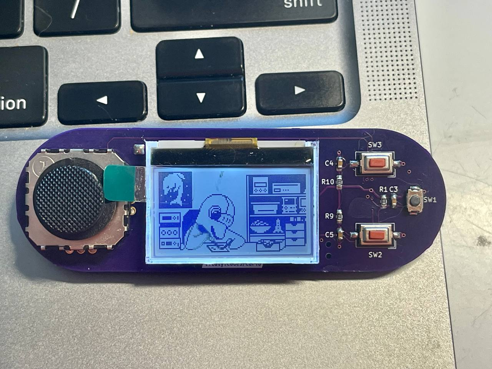

# Curio

Glorified Infrared Remote Control.

## Resources

- [Schematics](docs/curio.pdf)
- [Gerber files](docs/curio_pcb_rev_0x02.zip)
- [Interactive BOM](https://htmlpreview.github.io/?https://github.com/dotcypress/curio/blob/main/docs/ibom.html)
- [Rust firmware](https://github.com/dotcypress/curio-firmware)

## Credits

* [`1-Bit Icons`](https://vectorpixelstar.itch.io) by VectorPixelStar
* [`Edition 12`](https://www.dafont.com/edition-12.font) font by Designer's High
* [`BM Army`](https://www.dafont.com/bm-army.font) font by BitmapMania
* [`Nokia Cellphone FC`](https://www.dafont.com/nokia-cellphone.font) font by Zeh Fernando

## License

Licensed under either of

- Apache License, Version 2.0 ([LICENSE-APACHE](LICENSE-APACHE) or
  http://www.apache.org/licenses/LICENSE-2.0)
- MIT license ([LICENSE-MIT](LICENSE-MIT) or http://opensource.org/licenses/MIT)

at your option.

### Contribution

Unless you explicitly state otherwise, any contribution intentionally submitted
for inclusion in the work by you, as defined in the Apache-2.0 license, shall be
dual licensed as above, without any additional terms or conditions.
